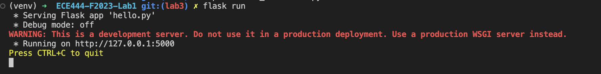
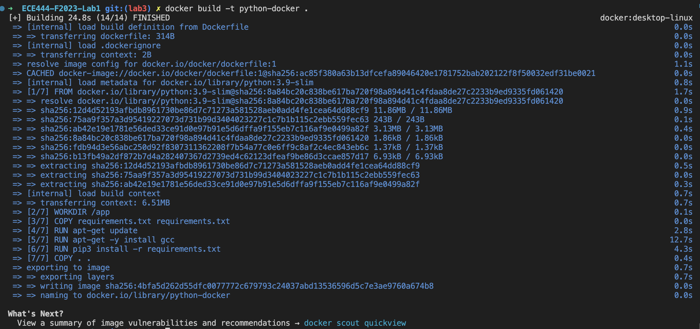
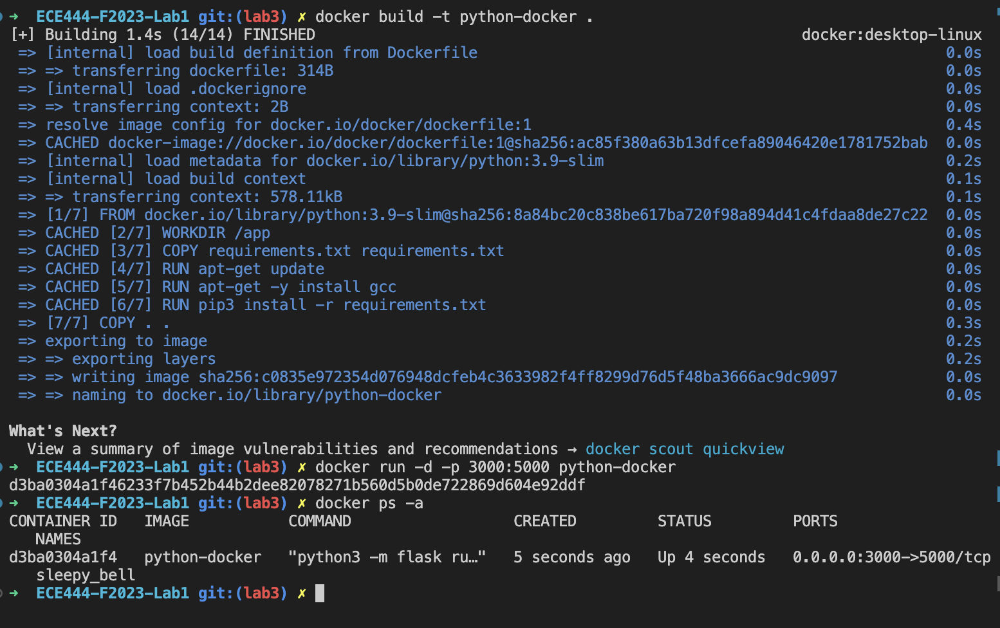

### Dylan Sun 

git repo copied from https://github.com/ECE444-2022Fall/Assignment_1_starter_template/tree/docker-prep

## Activity 1
### set lab 3 to default branch 

## Activity 2

## Activity 3
### New docker message in app local

### Screenshot of app running locally 

### Screenshot of commit 

## Activity 4
### docker build command message 

### docker run 
