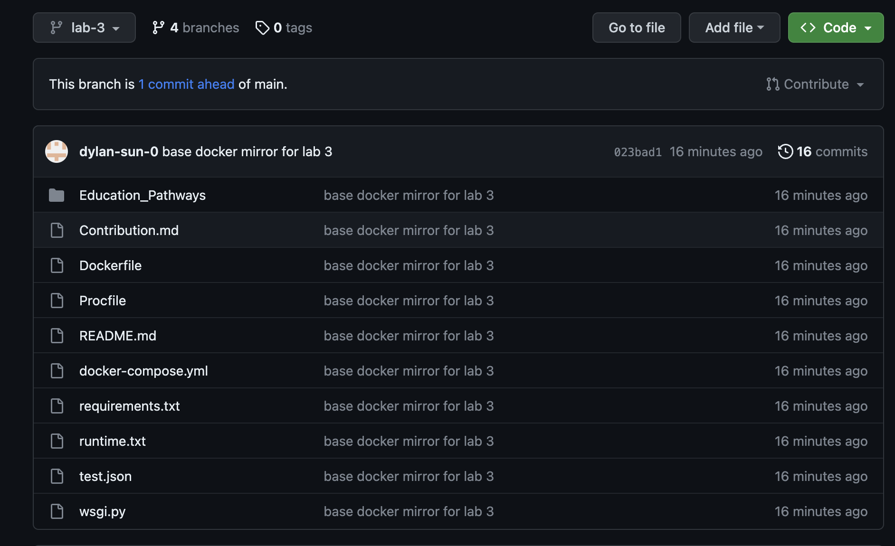
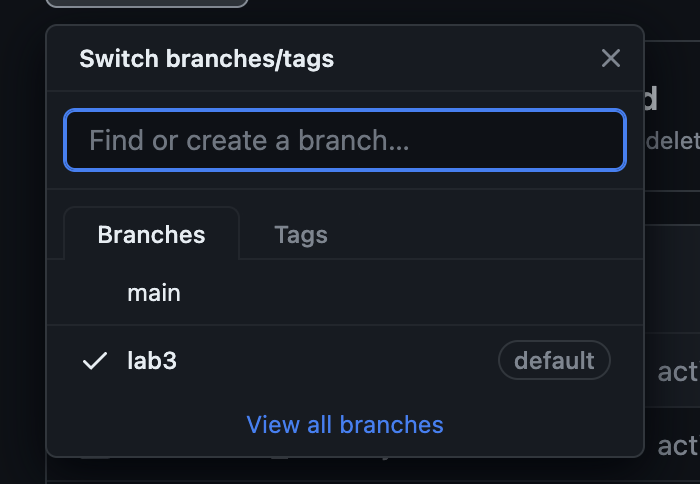
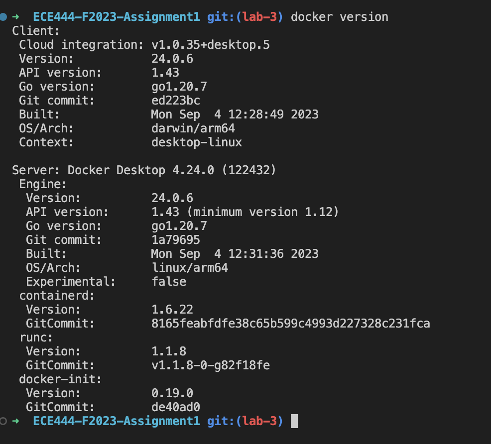
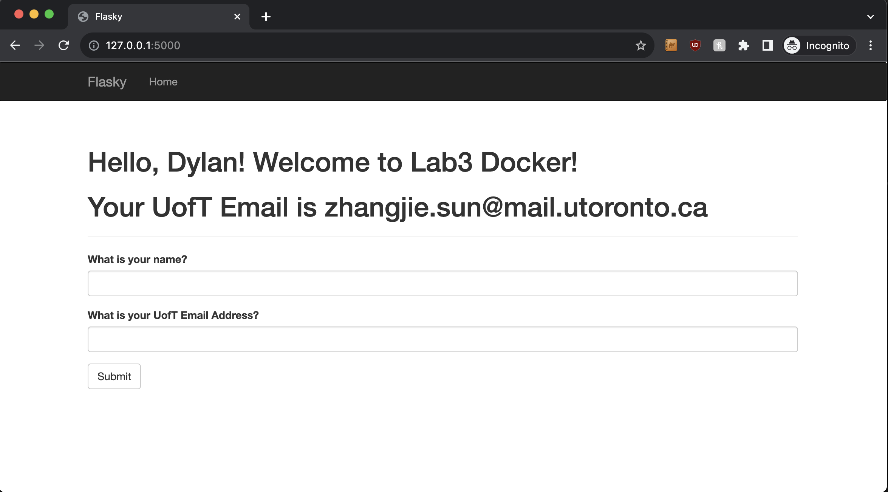

### Dylan Sun 

git repo copied from https://github.com/ECE444-2022Fall/Assignment_1_starter_template/tree/docker-prep

## Activity 1

### set lab 3 to default branch 

## Activity 2

## Activity 3
### New docker message in app local

### Screenshot of commit 
